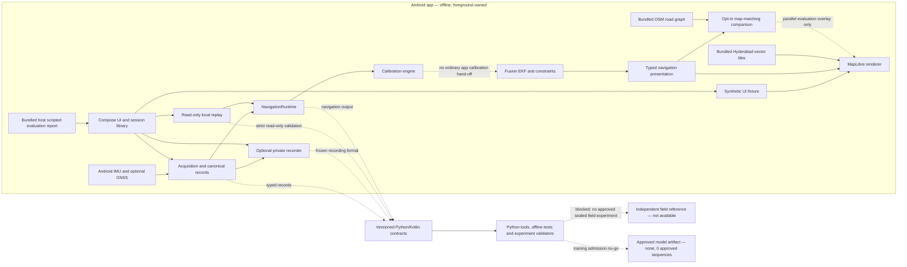

# Local prototype architecture (as built)

## Data boundaries

- Android sensors/location feed the typed acquisition stream. Optional recording writes to
  private no-backup storage; export is a separate user-initiated local copy; replay reads
  existing sessions without rewriting them. All stop on lifecycle/background boundaries.
- The map displays exactly one selected source: synthetic UI, recorded raw GNSS, live raw
  GNSS, or navigation-engine output. Map rendering is not localization. Road matching is an
  optional, side-by-side comparison and does not overwrite navigation output.
- Calibration and fusion/constraints have host-tested implementations, but normal app flow
  provides no valid calibration hand-off. Thus a real calibrated navigation solution is not
  an implemented end-user capability.
- Python research/validation tools are offline and do not run in the Android app. The only
  checked-in evaluation report scores generated inputs against scripted truth; it is not
  independent field evidence. No trained model exists.
- There is no app server, account store, telemetry path, online map fallback, or runtime
  network permission.

See [capability matrix](PROTOTYPE_CAPABILITIES.md),
[local package procedures](../RELEASE_PACKAGE.md), and
[known limitations](../KNOWN_LIMITATIONS.md).
