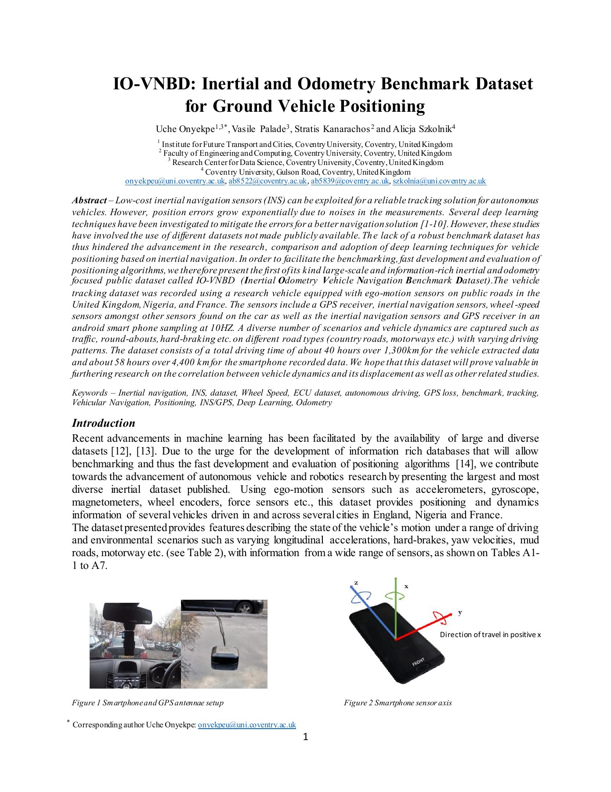

# Body-frame conventions and causal initialization

## Verdict and scope

**Confirmed from data:** VBOX heading increases clockwise from north; its recorded
yaw-rate channel is positive for left turns. VBOX lateral acceleration is positive
left, longitudinal acceleration is positive forward, and the indicated acceleration
channels require the documented g-to-m/s² conversion. Smartphone accelerometer
minus the supplied gravity-like vector cancels the stationary gravity term.

**Inferred with supporting evidence:** the smartphone source column **GYROSCOPE
Pitch (rad/s)**, with **positive sign**, represents vehicle yaw rate in the accepted
development windows of M, S1 and S3c. This is a channel-label finding, not a claim
that physical pitch rotation equals yaw or that Android gyro Y is vehicle Z.

**Still unresolved:** a stable phone-to-vehicle mounting rotation, the raw CSV
axes' exact correspondence to Android device axes, and a full physical gyro triad.
Seven of 18 maneuver windows meet the yaw gate; none meets the acceleration
mounting gate. Do not hard-code one mounting angle for all recordings. The
diagnostic/math implementation is tested, but full 3-D INS frame calibration is
**not approved** by these measurements.

The study covers six distinct categorized recordings from three drivers: M (B),
S1/S2/S3c (A), Vta2/Vw11 (E). Phase 0 marks S1/S3c synchronization uncertain and
the other four approximate. Those labels remain in the new evidence; strong local
gyro agreement does not upgrade a whole recording's supervision eligibility.

Full results, all six channel/sign candidates in every window, zero/best-lag
metrics and matrices are in [body_frame_metrics.md](body_frame_metrics.md) and
[body_frame_metrics.json](body_frame_metrics.json). Existing Phase 0 reports were
not regenerated. No INS propagation was changed.

## Evidence sources and the axis illustration

**Stated by dataset documentation:** local IO-VNBD `README_1.pdf`, page 1,
Figure 1 shows the phone mounting; Figure 2 illustrates smartphone sensor axes.
Page 2 identifies AndroSensor and VBOX Video HD2; page 3 describes manual
synchronization and vibration; page 4, Table 3 labels yaw in deg/s and acceleration
in g. The diagram below was rendered directly from that local PDF, not redrawn.
The related [authors' paper](https://arxiv.org/abs/2005.01701) is an external reference;
its pagination can differ from the repository's 15-page PDF.



**Confirmed by visual inspection:** Figure 2 labels the approximately screen-normal
arrow x, a lateral arrow y and the lengthwise arrow z; an annotation describes
travel as positive x. This is not the ordinary Android x-right/y-top/z-out drawing.
The photograph alone cannot establish exported CSV axis order.

**Confirmed from data:** mean raw GRAVITY Z is approximately +9.8065 m/s² across
all six recordings, with much smaller X/Y means. Treating the figure's x label as
the CSV gravity/vertical axis contradicts those measurements. The illustration
therefore supports an intended mounting description, not an unverified relabeling
of every sensor column. Whether the export permutes or transforms device axes
remains unresolved. Table 4 even repeats a Pitch gyro label; labels are not proof.

**Stated by Android documentation:** device axes are fixed to the screen in its
natural orientation: X right, Y toward the top, Z outward. Screen rotation does not
change the sensor axes. See [Android sensor coordinates](https://developer.android.com/develop/sensors-and-location/sensors/sensors_overview#sensors-coords).
Gyro rates are right-handed rad/s. A stationary face-up accelerometer reports
approximately +g on Z, and the gravity sensor should match the accelerometer at
rest. See [Android motion sensors](https://developer.android.com/develop/sensors-and-location/sensors/sensors_motion).

**Documentation limitation:** [Racelogic signing conventions](https://en.racelogic.support/VBOX_Automotive/Knowledge_Base/Signing_Conventions)
distinguish products and channel types. IO-VNBD's indicated acceleration/yaw
channels originate from the vehicle CAN bus; do not substitute a different VBOX
IMU product's signing diagram. The sign checks below use the actual recordings.

## Frame definitions

Notation is an explicit project mathematical convention: column vectors,
`v_target = C_target_source @ v_source`. A proper rotation must satisfy
`C @ C.T = I` and `det(C) = +1`. Positive angular rotation follows the right-hand
rule: counterclockwise when looking from the positive axis toward the origin.

| Frame | Positive X | Positive Y | Positive Z | Handedness / evidence |
|---|---|---|---|---|
| P: raw smartphone acceleration/gravity CSV basis | Literal ACCELEROMETER/GRAVITY X direction; physical phone direction unresolved | Literal Y direction; physical phone direction unresolved | Literal Z; aligned approximately with upward gravity-like output in these recordings | Analysis models P as a right-handed basis; its correspondence to device axes is not empirically established |
| D: Android device | Right side of screen | Top of screen in natural orientation | Out of screen | Right-handed, Android specification; do not assume P=D |
| V: project vehicle | Forward along vehicle centerline | Left | Up | Right-handed, defined convention |
| N: local ENU navigation | East | North | Up, normal to local tangent plane | Right-handed, defined convention; true north for GNSS course |
| B: normalized VBOX acceleration reference | Forward, measured long channel | Left, measured lateral channel | Up to complete the declared reference basis; vertical acceleration not supplied | Right-handed mathematical completion; not a measured 3-axis VBOX accelerometer triad |

| Frame / quantity | Heading convention | Positive yaw | Gravity/sign convention |
|---|---|---|---|
| P raw sensor basis | No intrinsic absolute heading. ORIENTATION Yaw is a source label and is not automatically vehicle course | Physical +Z rotation if P is established; raw gyro label-to-axis mapping unresolved | Supplied gravity-like vector has dominant +Z; `linear_p = accel_p - gravity_sensor_p` |
| D Android device | No intrinsic vehicle heading; a chosen device direction needs mounting and north reference | Right-hand rotation about device +Z; not necessarily vehicle yaw | At rest accelerometer and gravity-like sensor agree; physical gravitational acceleration has the opposite direction |
| V vehicle | H=0 north, H=90° east for vehicle-forward course during straight forward motion | Left turn about +Z; H decreases | Physical gravity on a level vehicle is `[0,0,-g]`; gravity-like rest output is `[0,0,+g]` |
| N ENU | Mathematical yaw ψ=0 east, ψ=+90° north | Counterclockwise about up | Physical gravity `[0,0,-9.80665]` m/s² |
| B VBOX reference | Recorded heading H is clockwise from north; course can differ from body heading during reverse/slip | Recorded yaw rate is left-positive; `r = -dH/dt` after converting H to radians | Long/lateral fields are in g; gravity compensation/grade influence is not separately established |

Roll is rotation around physical X and pitch around physical Y only after a
physical frame has been established. The CSV gyro fields named Roll/Pitch/Yaw
remain separate **source channels**. Never construct `omega_P=[Roll,Pitch,Yaw]`
merely from their names. Likewise, Euler-angle derivatives are not in general
equal to body gyro components.

## Reference sign and unit checks

**Confirmed from data:** moving samples above 3 m/s were compared using a centered
2-second heading/speed derivative, excluding repeated/backward timestamps and
intervals crossing gaps. The derivative is an offline convention check only.

| Sequence | corr(VBOX yaw, −heading derivative) | Slope | corr(lateral × g, speed × yaw) | corr(long × g, speed derivative) |
|---|---:|---:|---:|---:|
| M | 0.984 | 1.020 | 0.973 | 0.854 |
| S1 | 0.982 | 1.031 | 0.922 | 0.850 |
| S2 | 0.985 | 1.038 | 0.940 | 0.926 |
| S3c | 0.930 | 0.925 | 0.941 | 0.798 |
| Vta2 | 0.975 | 1.052 | 0.917 | 0.912 |
| Vw11 | 0.989 | 1.030 | 0.955 | 0.932 |

Regression here is predicted channel versus reference motion. For longitudinal
acceleration, scaling the raw field by 9.80665 changes slopes from 0.077–0.109 to
0.756–1.065. Correlation alone cannot distinguish those scale hypotheses. Both
hypotheses' intercepts, RMSE and NRMSE appear in the detailed evidence.
VBOX speed is explicitly divided by 3.6; VBOX yaw is explicitly multiplied by π/180.

**Inferred:** forward speed times left-positive yaw produces left-positive lateral
acceleration for approximately planar, non-slipping forward travel. This independent
physical check supports the signs. It is not an exact model during sideslip,
banked turns, reversing, or transient vehicle roll.

## Corrected gyro selection and stability

**Implemented mathematical method:** rank all three source gyro channels with both
signs. Score at zero lag combines signed correlation, slope proximity to +1,
intercept relative to reference standard deviation, unadjusted normalized RMSE,
and lateral consistency with `speed * candidate_yaw`. No regression scaling or
intercept subtraction is applied to make a candidate look better.

The small diagnostic lag range is ±10 rows (nominal ±1 second). All lags use the
same central reference support. Positive lag means comparing phone[i+lag] to
VBOX[i]. Zero-lag metrics use the whole window. Best-lag correlation, slope,
intercept, RMSE and NRMSE are reported separately, including boundary solutions.
Best lag is never automatically applied to a stream or used to rescue a rejected
zero-lag candidate.

**Declared acceptance gates:** correlation ≥0.8, slope 0.7–1.3, NRMSE ≤0.7,
absolute intercept ≤0.03 rad/s and reference yaw standard deviation ≥0.025 rad/s.
These are engineering gates, not calibrated probabilities or significance tests.

| Sequence | Accepted / tested windows | Accepted mapping | Zero-lag correlation range |
|---|---:|---|---:|
| M | 1 / 3 | +GYROSCOPE Pitch | 0.9096 |
| S1 | 3 / 3 | +GYROSCOPE Pitch | 0.9560–0.9715 |
| S2 | 0 / 3 | unresolved | — |
| S3c | 3 / 3 | +GYROSCOPE Pitch | 0.9204–0.9641 |
| Vta2 | 0 / 3 | unresolved | — |
| Vw11 | 0 / 3 | unresolved | — |

**Validity restriction:** accept the channel/sign hypothesis only for reviewed,
qualifying windows. M's later windows fail; this is not a whole-M calibration.
The rejected windows' top-ranked channel is merely the least-bad numerical
candidate. Roll/pitch mappings and empirical units for unrelated channels remain
unresolved without suitable 3-axis reference motion.

## Acceleration, stationary behavior and mounting

**Confirmed from data:** stationary sections were selected using both phone GPS
and VBOX speed below 0.3 m/s plus low gyro norm for at least two nominal seconds,
split at bad clock intervals. Acceleration-minus-gravity was deliberately excluded
from selection to avoid circularly proving the chosen subtraction sign.

Across sequences, stationary median accelerometer magnitudes are approximately
9.85–9.88 m/s². Median minus-gravity norms are approximately 0.18–0.28 m/s²,
whereas plus-gravity norms are approximately 19.65–19.68 m/s². Exact counts and
distributions are in the evidence. This supports subtraction, while the nonzero
residual shows that gravity cancellation is not full bias/vibration calibration.

**Implemented mathematical method:** normalize mean gravity to the upward unit
vector u. Project a deterministic reference hint (raw +X unless nearly vertical)
onto the horizontal plane to obtain f; let l=u×f. Then

```text
L = [ f.T ; l.T ; u.T ]
C_VP(phi) = Rz(phi) @ L
Rz(phi) = [[cos(phi), -sin(phi), 0],
           [sin(phi),  cos(phi), 0],
           [       0,         0, 1]]
```

`L` and `C_VP` are proper rotations and map the gravity-like vector to +Z.
One centered 2-D Procrustes fit estimates phi against VBOX long/left acceleration.
Only proper SO(2) rotations are allowed; scales and reflections are not fitted.
The tiny ordering of gravity X/Y cannot switch the reference hint by 90 degrees.

Discrete horizontal permutations followed by arbitrary yaw are alternative
parameterizations of the same final rotation. They are no longer reported as
independent winners. Tests explicitly compose these alternatives and deduplicate
their total matrices. The retained v1 permutation helper rejects determinant −1;
its shared-accel/gyro evaluation method and old main are disabled with explanatory
errors. All three current diagnostic entry points use the shared corrected audit.

**Still unresolved:** no fixed mounting rotation passed the declared gates: adequate
two-axis excitation plus correlation ≥0.7, slope 0.7–1.3 and NRMSE ≤0.8 on both
axes, including a first-half fit evaluated without refitting on the second half.

| Sequence | Maximum separation of fitted proper rotations across windows |
|---|---:|
| M | 96.99° |
| S1 | 40.87° |
| S2 | 79.60° |
| S3c | 169.87° |
| Vta2 | 57.26° |
| Vw11 | 51.13° |

These spreads are disagreements between estimates, not proof the physical mount
actually moved. Noise, synchronization and an insufficient constant-rotation model
can also produce them. All 18 matrices in the evidence have determinant +1,
but mathematical validity alone does not make them empirically correct.

**Example, not an approved calibration:** M rows 1500–2699 give approximately

```text
C_VP = [[ 0.8849856, -0.4656184,  0.0000872],
        [ 0.4656184,  0.8849856,  0.0000044],
        [-0.0000792,  0.0000367,  1.0000000]]
```

The exact matrix is in JSON. Its longitudinal/lateral correlations are only
0.210/0.508, so Prompt 4 must not silently adopt it.

**Observed effects:** IMU values change on almost every row; VBOX acceleration and
yaw channels exhibit repeated/quantized values. GPS position changes on about 1%
of rows for most sequences and about 9.3% for Vta2. These rates include stationary
holding and cannot identify hardware sampling frequency by themselves. A trailing
5-row mean improves some acceleration correlations (for example S1 middle window
longitudinal 0.58→0.72, lateral 0.66→0.77), but does not establish stable mounting.
The filter introduces about 0.2 seconds of nominal group delay. Residual RMS
includes this delay, not exclusively vibration. Acceleration lag optima often lie
at the ±1-second search boundary; they are inconclusive and are not applied.

**Unresolved causes:** the available evidence cannot uniquely separate vibration,
sensor filtering, synchronization errors, actual mount motion and possible export
frame changes. Expanding a lag search until one metric improves would not establish
a physical mapping. Device-frame/export verification needs controlled signed-axis
motions or the logger's actual channel mapping, and mounting needs an independently
verified calibration or stronger synchronized acceleration evidence.

## Causal initial attitude for a future app

The mathematical prototype `training.frame_math.CausalCalibration` consumes only
arrived samples. It implements calibration state and rotation construction, not INS
propagation or Android code. The following thresholds are explicit design choices.

1. Collect a rolling 2-second IMU buffer with at least 20 samples and no timestamp
   gap above 0.25 seconds. Require finite values, gravity norm 9.3–10.3 m/s²,
   accelerometer-minus-gravity norm below 0.3 m/s², gyro norm below 0.05 rad/s and
   gravity-vector standard-deviation norm below 0.1 m/s². At a known standstill
   these gates also support bias measurement; a quiet constant-speed interval alone
   must not be called zero velocity. Level from mean gravity only after the buffer
   has arrived. Low dynamics reduce, but do not eliminate, gravity-estimator errors.
2. An independently known phone-forward mounting hint is required. Gravity determines
   tilt, not mounting yaw. A guided physical mounting alignment or separately
   validated motion calibration must supply that hint. A VBOX-fitted angle cannot
   be used as an available phone feature. Without the hint, return
   `mounting_unresolved`, with yaw confidence zero.
3. Wait for forward, approximately straight travel and two distinct, timestamped
   GNSS fixes. Require speed ≥3 m/s, accuracy in (0,10] m, no GNSS interval above
   3 seconds, and fresh IMU within 0.25 seconds. Require displacement at least
   `max(15 m, 3*sqrt(accuracy_start²+accuracy_end²))`, reached within 30 seconds.
   `forward_motion` and `straight_motion` are explicit evidence inputs; the prototype
   does not invent a reverse/slip detector. Their future implementation must be
   validated. Reject/restart the course buffer when these conditions fail.
4. Compute course from the arrived fix pair. For straight forward motion it estimates
   current vehicle heading; a turning or slipping chord is not instantaneous body
   heading. Convert to ENU with ψ=π/2−H and construct `C_NP = Rz(ψ) @ C_VP`, where
   C_VP uses the validated forward hint and measured level. Output the current fix
   time as `available_at_s`. Never assign this heading to time zero retroactively.
5. Before motion, retain tilt-only state and yaw confidence zero; position/velocity
   navigation waits for calibration. With unreliable magnetometer data, continue
   waiting for GNSS course. This prototype never consumes magnetometer measurements.
   A later magnetic fallback would require independent field-quality checks and
   magnetic-to-true-north correction; none is assumed here.
6. The prototype uses level confidence 0.9 and accepted course confidence 0.8 as
   engineering state scores, not measured probabilities. It separately reports
   `atan2(combined position accuracy, displacement)` as approximate course angular
   uncertainty; GNSS accuracy semantics mean this is not a guaranteed bound.
   Missing fixes, low speed, poor accuracy, stale IMU, reverse/curvature uncertainty
   or absent mounting keep yaw at zero confidence. Clock gaps invalidate leveling;
   phone remounting, impacts or sensor changes require discarding the calibration
   instance and collecting a fresh buffer. The app must detect or request that reset.

The old INS baseline remains available only with `--offline-baseline`. Its future
GPS/VBOX-assisted initialization is explicitly historical replay. The helper
`estimate_initial_heading` rejects look-ahead unless `allow_future=True` is supplied.
`run_ins` has not been changed. This flag does not certify its old physical mappings.

## Reproduction, tests and integrity

```powershell
python -B -X utf8 -m unittest discover -s tests -v
python -B -X utf8 -m training.frame_audit --write-report
python -B -X utf8 -m training.diagnose_body_frame_v2 --duration 60 --start 150 --no-write
```

The audit defaults to read-only; `--write-report` writes only the new body-frame
metrics artifacts, hashes its analysis dependencies, and compares full raw-tree
SHA-256/size/timestamp snapshots before and after analysis. It reads one pair at a
time. All 54 tests pass, including known 90° transforms, orthogonality/determinant,
gravity alignment, signed turns, sign ties, scale rejection, reflected data,
equivalent rotations, lag semantics, stationary behavior and causal availability.

Window selection and mounting fits use reference data for development diagnosis.
M's first 60 seconds contain a repeated VBOX timestamp after zero-based row 220;
an explicit window starting at zero is rejected. The example uses a later clean
window. This is separate from the two later smartphone DATE gaps found in Phase 0.
Do not use these selected windows as an untouched future test set. Freeze splits
by recording group; learn any mounting or alignment on training/calibration data
only. Evaluate on untouched sequences with frozen parameters or a separately
declared causal online calibration protocol.

## Exact conventions for Prompt 4

- Vehicle V: **X forward, Y left, Z up**, right-handed.
- Navigation N: **X east, Y north, Z up**, right-handed.
- Matrix direction: **column vectors**, `v_V=C_VP @ v_P`, `v_N=C_NV @ v_V`.
  Require orthogonality and determinant +1; keep total rotations rather than
  discrete labels plus an independently reapplied yaw.
- Heading H: **clockwise from true north**, degrees at the data boundary.
  ENU yaw: `psi = wrap_pi(pi/2 - radians(H))`.
  `C_NV = [[sin(H),-cos(H),0],[cos(H),sin(H),0],[0,0,1]]`, with H in radians here.
- Vehicle yaw rate r: **left-positive**, rad/s; `r=-d(radians(H))/dt`.
  VBOX: `r=radians(raw_yaw_rate)`. Accepted phone development windows:
  `r=+raw_GYROSCOPE_Pitch`; do not generalize this to rejected windows or Android Y.
- Linear acceleration: **`a_P=accelerometer_P-gravity_sensor_P`**, m/s².
  Transform it without subtracting gravity again. If instead using raw specific
  force in a future mechanization, add physical `g_N=[0,0,-9.80665]` once after
  rotation; these are distinct input contracts and must not be mixed.
- Reference acceleration: `a_Vx=9.80665*VBOX_long_g`,
  `a_Vy=9.80665*VBOX_lat_g`; reference speed `v=VBOX_kmh/3.6`.
- Initialize only at the timestamp when calibration and the required GNSS fixes
  have arrived. Do not seed a deployable solution from VBOX or future data.
- **Gate:** mounting yaw and gyro X/Y are unresolved. Prompt 4 may use these frame
  definitions and synthetic rotation tests, but must not promote the current
  diagnostic mounting fits or source gyro labels to a validated full 3-D INS.
